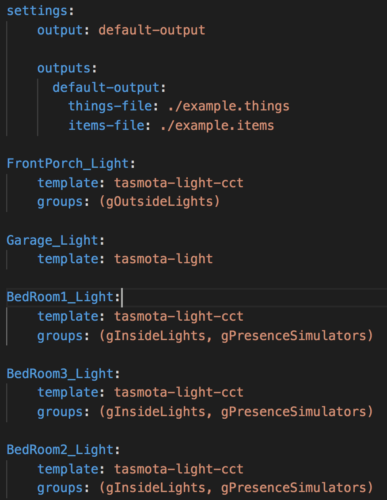
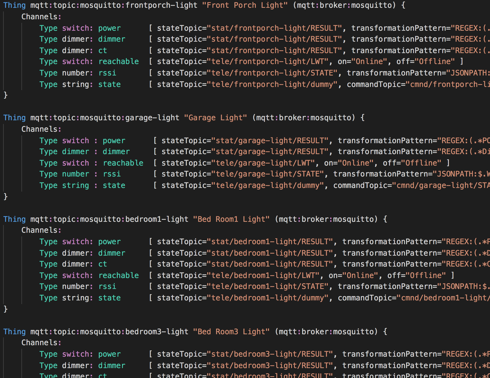
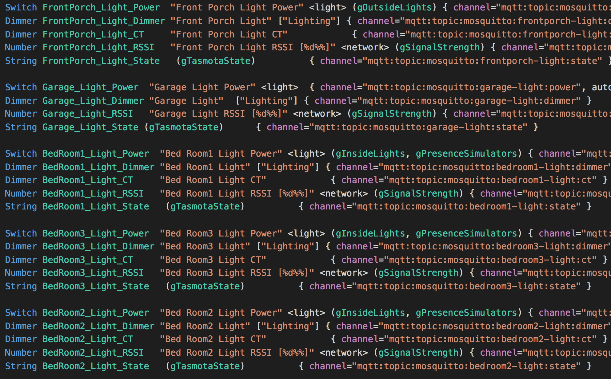

# ohgen - OpenHAB Things and Items Generator

A template-based OpenHAB .things and .items file generator written in Python using [Jinja2](https://palletsprojects.com/p/jinja/) template engine.

The thing and items definitions are usually repetitive when you have multiple devices of the same type. The process of adding and maintaining .things and .items files involve tedious copy pasting and renaming. Changing how they are all defined is even more tedious.

`ohgen` enables you to create a template for each type of device and then generate the actual .things and .items files from a list of devices stored in `devices.yaml` file.

It turns this:


Into these:





## Usage

- Copy `quickexample.yaml` to `devices.yaml`
- Copy the directory `sample-templates` to `templates`

For convenience, `devices.yaml` will be used by default when no file is specified on the command line:
```
./ohgen.py
```

To use a different file, specify it on the command line:
```
./ohgen.py fullexample.yaml
```

By default, `ohgen` will prompt for confirmation if the output file already exists. To overwrite without prompting, specify `-o` or `--overwrite` in the command line, i.e.:
```
./ohgen.py -o
```

## Config and Device List File: `devices.yaml`

The `devices.yaml` file contains list of devices/things to be generated. For examples: see `quickexample.yaml` and `fullexample.yaml`


### The `settings` section

The `settings:` section inside `devices.yaml` consists of three areas, best illustrated in this excerpt
- Global variables - variables that appear directly under the `settings` section. These variables act as a fall back / default for the corresponding setting.
  - `output`
  - `template`
  - `header`
- `templates:` # defines the list of template names
  - `template1-name:` # the name of the template
    - `template-file:` (optional) path to the template-file. This path can be an absolute path, or relative to devices.yaml file. 
    
        When this setting is omitted, the default is set to "templates/template1-name.tpl" - where `template1-name` is the name of the template section above. 
    - `output`: (optional) outputname that applies for this template, overrides the global `output` variable
  - `template2-name:` # another template, for a different type of device or the same device but different configurations
    - `template-file:` path-to-the-template-file
    - `output:` `outputname` Multiple templates can be directed to the same outputname, which in turn will be saved in to the same files

- `outputs:` #The list of output file definitions
  - `output1-name:` 
    - `things-file:` path to the .things file, absolute or relative to this file (devices.yaml). Example: /openhab/conf/things/thingsfilename.things
    - `items-file:` path to the .items file. Example: /openhab/conf/items/itemsfilename.items
    - `things-file-header:` # extra headers to insert at the top of the generated .things file
    - `items-file-header:` # extra headers to put at the top of the generated .items file

## Template

By default, template files are stored in `templates/` subdirectory, relative to the `devices.yaml` file, however this can be overridden in the devices.yaml file.

A template file contains the template of both Things and Items required for a particular type of device. The general format for the template file is as follows:

```php
# Hash comments are allowed and will be omitted from the generated file
// Thing / Item comments starting with double slashes will be included.
Thing thingid ..... {
    // put Thing comments inside the Thing declaration, otherwise they will go into the Items file.

}

Switch ItemName_XX ......
Number ItemName_YY ....
```

A template can contain only Thing, or only Items, or both. Multiple Things, Bridges, and Items can exist in a template. 

Rules for Thing and Bridge definition in the template:
- The opening brace must be at the end of the same line as `Thing` or `Bridge`
- The closing brace must be on its own separate line
- A `Thing` can be nested inside a `Bridge` observing the rules above

Variables from `devices.yaml` for the device will be substituted in the template file. Each thing entry in the yaml file will be loaded as a dictionary, which can be used inside the template. For detailed information about the template syntax, see [Jinja2 Template Designer](https://jinja.palletsprojects.com/templates/).

For more detailed examples, see the included templates in the sample-templates directory. Note that the included templates may change in the future. 


